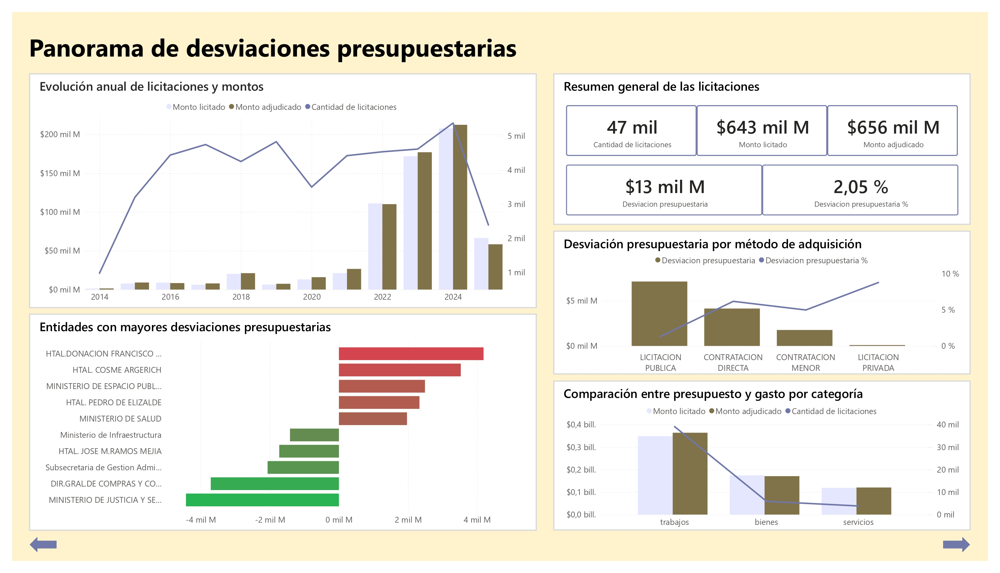
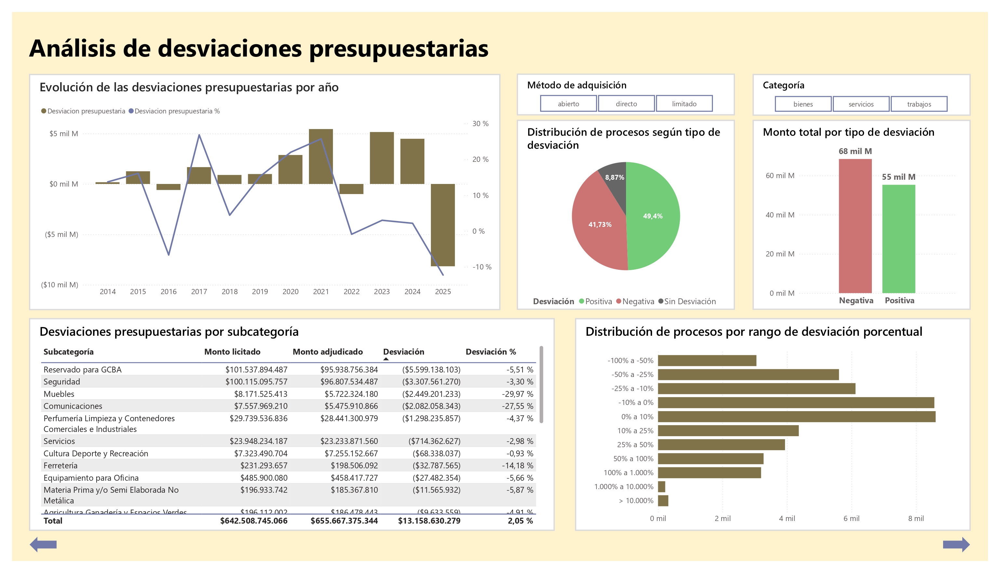

## Descripción

Este dashboard fue desarrollado en **Power BI** con el objetivo de analizar los procesos de compra de Buenos Aires Compras (BAC), comparando los **montos licitados y adjudicados** para identificar desviaciones presupuestarias, patrones de comportamiento y posibles anomalías.

El reporte utiliza los datos previamente procesados y modelados en SQL Server, transformándolos en un conjunto de visualizaciones interactivas orientadas al análisis y la toma de decisiones.

---

## Portada

La portada presenta el objetivo del proyecto y el período analizado, funcionando como punto de entrada al dashboard.


---

# Estructura del dashboard

El dashboard está compuesto por tres páginas principales, cada una orientada a un nivel diferente de análisis:

1. **Panorama de desviaciones presupuestarias:** permite obtener una perspectiva general de los procesos de compra.
2. **Análisis de desviaciones:** profundiza en las diferencias entre los montos licitados y adjudicados.
3. **Análisis por entidad:** permite identificar las entidades contratantes con mayores desviaciones y analizar su comportamiento.

---

# 1. Panorama de desviaciones presupuestarias



Esta página proporciona una visión general de los procesos de compra y permite analizar los montos involucrados según diferentes dimensiones, como **categoría, método de adquisición, entidad contratante y período**.

El objetivo es establecer un punto de partida para comprender la distribución de los procesos y detectar comportamientos que requieran un análisis más profundo.

### Principales aspectos analizados

* Distribución de los montos licitados y adjudicados.
* Cantidad de procesos según categoría.
* Comportamiento de los procesos según método de adquisición.
* Evolución de los procesos a través del tiempo.
* Participación de las distintas entidades contratantes.

---

# 2. Análisis de desviaciones presupuestarias



Esta página se enfoca en la **desviación presupuestaria**, definida como la diferencia entre el monto adjudicado y el monto originalmente licitado.

La desviación porcentual permite comparar procesos de diferentes magnitudes y detectar aquellos que presentan variaciones significativas respecto del presupuesto inicial.

### Clasificación de las desviaciones

Los procesos se clasificaron según el resultado obtenido:

* **Favorable:** el monto adjudicado fue inferior al monto licitado.
* **Igual:** el monto adjudicado coincidió con el monto licitado.
* **Negativa:** el monto adjudicado superó el monto licitado.

Esta clasificación permite identificar rápidamente qué proporción de los procesos presentó resultados favorables, iguales o desfavorables.

### Análisis de anomalías

Además del comportamiento general, se analizaron los procesos con desviaciones porcentuales extremas para identificar posibles valores atípicos y situaciones que requieren una revisión específica.

El análisis combina indicadores generales con visualizaciones de distribución y detalle para facilitar la identificación de estos casos.

---

# 3. Desviaciones por entidad contratante


La tercera página profundiza el análisis desde la perspectiva de las **entidades contratantes**.

El objetivo es identificar aquellas entidades que concentran las mayores desviaciones acumuladas y analizar si estas desviaciones se deben a una gran cantidad de procesos o a casos puntuales de alta magnitud.

### Principales indicadores

Se analizan:

* Entidades con mayores desviaciones acumuladas.
* Cantidad de procesos por tipo de resultado.
* Distribución entre resultados favorables, iguales y desfavorables.
* Magnitud de las desviaciones.
* Comportamiento individual de las entidades seleccionadas.

La combinación de estos indicadores permite diferenciar entre entidades con una desviación acumulada elevada debido a su volumen de operaciones y aquellas que presentan resultados desfavorables de manera más recurrente.

---

# Medidas y cálculos principales

Para construir los indicadores del dashboard se desarrollaron medidas DAX orientadas al análisis de las diferencias entre los montos licitados y adjudicados.

### Diferencia

```DAX
Diferencia =
[Monto adjudicado] - [Monto licitado]
```

Esta medida representa la diferencia absoluta entre el monto adjudicado y el presupuesto originalmente licitado.

### Diferencia porcentual

```DAX
Diferencia porcentual =
DIVIDE(
    [Diferencia],
    [Monto licitado]
)
```

La diferencia porcentual permite comparar las desviaciones independientemente de la magnitud del proceso.

Las medidas fueron utilizadas como base para los indicadores, clasificaciones y visualizaciones presentes en el dashboard.

---

# Funcionalidades de Power BI

El reporte incorpora distintas funcionalidades para facilitar la exploración de los datos:

* **Segmentadores** para filtrar la información por período, categoría, método de adquisición y entidad contratante.
* **Interacción entre visualizaciones**, permitiendo analizar cómo cambia la información al seleccionar distintos elementos.
* **Navegación mediante botones y marcadores**, facilitando el recorrido entre las diferentes vistas del dashboard.
* **Tooltips personalizados**, utilizados para proporcionar información adicional sin sobrecargar las visualizaciones principales.
* **Medidas DAX** para la construcción de indicadores y métricas específicas del análisis.

Estas funcionalidades fueron implementadas buscando priorizar una experiencia de análisis clara e interactiva.

---

# Conclusiones

El dashboard permite analizar los procesos de compra desde una perspectiva general y profundizar progresivamente en las desviaciones presupuestarias.

El análisis parte de una visión global de los procesos y avanza hacia la identificación de **desviaciones y valores atípicos**, para finalmente focalizarse en las entidades contratantes que presentan mayores diferencias.

De esta manera, el reporte busca transformar los datos procesados en SQL Server en información útil para **identificar patrones, detectar situaciones que requieren revisión y facilitar el análisis de la ejecución presupuestaria**.

---

## Tecnologías utilizadas

* **Power BI** — Modelado, visualización y desarrollo del dashboard.
* **DAX** — Creación de medidas e indicadores.
* **SQL Server** — Preparación, transformación y modelado de los datos.