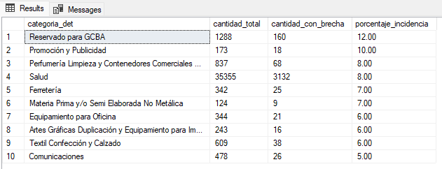
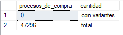
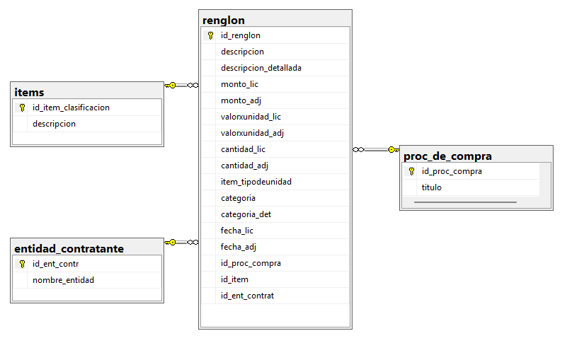

## Proceso de preparación y modelado de datos

Esta sección presenta una selección de consultas SQL desarrolladas durante el proceso de preparación de los datos para su posterior análisis y visualización en Power BI.

Para documentar el trabajo, se seleccionaron **4 consultas representativas de cada una de las principales etapas del proceso**, priorizando aquellas que reflejan decisiones relevantes y situaciones encontradas durante el análisis de los datos.

El proceso se organiza en cuatro etapas:

* **Limpieza y transformación:** tratamiento de inconsistencias, adecuación de formatos y preparación de los datos para su análisis.
* **Exploración:** análisis de los datos para comprender su estructura, identificar patrones y detectar posibles problemas de calidad.
* **Validación:** aplicación de controles para verificar la integridad, consistencia y confiabilidad de los datos procesados.
* **Modelado:** estructuración de los datos mediante la creación y organización de tablas orientadas al análisis, buscando reducir redundancias y facilitar su utilización en el modelo dimensional.

La selección de consultas busca mostrar tanto el **uso técnico de SQL Server** como el **razonamiento analítico aplicado a los datos**: identificar un problema, investigarlo, validar los resultados y tomar decisiones para construir un conjunto de datos confiable y adecuado para el análisis.

Este proceso constituye la base sobre la cual se desarrolla posteriormente el modelo y el dashboard en Power BI.


### 01. Limpieza y transformación

```sql
 Elimino los caracteres numericos y los guiones a los valores de mi columna [descripcion_limpia]
	while exists(
			select 1
			from LIC
			where PATINDEX('%[0-9-]%', descripcion_limpia) > 0
	)
	begin
		update LIC
		set descripcion_limpia = TRIM(
			STUFF(
				descripcion_limpia,
				PATINDEX('%[0-9-]%', descripcion_limpia),
				1,
				''
			)
		)
		where PATINDEX('%[0-9-]%', descripcion_limpia) > 0;
	END;
```

### 02. Exploracion

Creamos una vista para visualizar que grado porcentual de incidencia tienen las categorias en las brechas presupuestarias
```sql
create view incidencia_en_brecha_por_categoria as 
	with brecha_p as(
	select
		id_proc_compra
	from proc_de_compra
	where cast((monto_LIC - monto_ADJ) / monto_LIC * 100 as decimal(18,3)) <= -100
	), -- Procesos de compra con una brecha presupuestaria menor a -100%
	totales_por_cat as(
	select
		lic.categoria_det,
		count(distinct(lic.id_proc_compra)) as cantidad_total
	from LIC
	group by lic.categoria_det
	), -- Agrupo los procesos de compra en las categorias
	afectados_por_categoria as(
	select
		lic.categoria_det,
		count(distinct(b.id_proc_compra)) as cantidad_afectada
	from brecha_p b
	left join LIC
		on b.id_proc_compra = lic.id_proc_compra
	group by categoria_det
	) -- agrupo los procesos de compra con brecha presupuestaria alta según la categoría
		select
		t.categoria_det,
		t.cantidad_total,
		coalesce(a.cantidad_afectada, 0) as cantidad_con_brecha,
		cast(coalesce(a.cantidad_afectada, 0) * 100  / t.cantidad_total as decimal (18,2)) as porcentaje_incidencia
	from totales_por_cat t
	left join afectados_por_categoria a
		on t.categoria_det = a.categoria_det
	;
				
	select 
		top 10 * 
	from incidencia_en_brecha_por_categoria
	order by porcentaje_incidencia desc;
```




Observamos que "Reservado para GCBA" es el área con un valor de brecha porcentual mas alto, con  %12.00 de sus licitaciones con una brecha presupuestaria desproporcionada.


### 03. Validación

¿Varian los valores [metodo_adquisicion] y [metodo_adquisicion_det] dentro del mismo proceso de compra?
```sql
	with variantes_mismo_procdecompra as
	(
		select
			id_proc_compra, 
			metodo_adquisicion,
			metodo_adquisicion_det,
			ROW_NUMBER() over (partition by id_proc_compra order by id_proc_compra) as cant
		from lic
		group by 
			id_proc_compra, 
			metodo_adquisicion,
			metodo_adquisicion_det
	)
	select
		count(distinct id_proc_compra) as procesos_de_compra,
		'con variantes' as cantidad
	from variantes_mismo_procdecompra
	where cant > 1
	union
	select
		count(id_proc_compra),
		'total'
	from proc_de_compra; 
```



Observamos que no existen variantes en los valores de las columnas [metodo_adquisicion] y [metodo_adquisicion_det] dentro del mismo proceso de compra, se debe a que cada licitacion tiene una sola forma de adjudicarse


### 04. Modelado


###### Integracion y transformación
Creo mi nueva tabla de hechos, nombrada 'renglon', en donde voy a integrar todos los valores que correspondan a los renglones individuales de cada proceso de compra. En mi modelo de datos tipo estrella, la tabla "renglon" será la tabla de hechos.


##### Creo la tabla, las llaves primarias (PK) y las llaves foraneas (FK)
```sql
	create table renglon(
		id_renglon nvarchar(100) not null,
		descripcion nvarchar(100) null,
		descripcion_detallada nvarchar(200) null,
		monto_lic decimal(14,2) null,
		monto_adj decimal(14,2) null,
		valorxunidad_lic decimal(13,2) null,
		valorxunidad_adj decimal(13,2) null,
		cantidad_lic decimal(11,2) null,
		cantidad_adj decimal(11,2) null,
		item_tipodeunidad nvarchar(100) null,
		categoria nvarchar(100) null,
		categoria_det nvarchar(100) null,
		fecha_lic date null,
		fecha_adj date null,
		id_proc_compra nvarchar(20) null,
		id_item nvarchar(25) null,
		id_ent_contrat nvarchar(40) null,


		constraint PK_renglon
			primary key (id_renglon),

		constraint FK_procdecompra
			foreign key (id_proc_compra)
			references proc_de_compra (id_proc_compra),

		constraint FK_item
			foreign key (id_item)
			references items (id_item_clasificacion),

		constraint FK_entidadcontratante
			foreign key (id_ent_contrat)
			references entidad_contratante (id_ent_contr)
	);

	-- Inserto los datos a la tabla renglon
	insert into renglon (id_renglon)
	select id
	from LIC;

	select * from renglon
	update r
	set descripcion = lic.descripcion,
		descripcion_detallada = adj.descripcion_detallada,
		monto_lic = lic.monto,
		monto_adj = adj.monto,
		valorxunidad_lic = lic.item_valorXu,
		valorxunidad_adj = adj.item_valorXu,
		cantidad_lic = lic.item_cantidad,
		cantidad_adj = adj.item_cantidad,
		item_tipodeunidad = lic.item_tipodeunidad,
		categoria = lic.categoria,
		categoria_det = lic.categoria_det,
		fecha_lic = lic.fecha,
		fecha_adj = adj.fecha,
		id_proc_compra = lic.id_proc_compra,
		id_item = lic.id_item_clasificacion,
		id_ent_contrat = lic.id_ent_contrat
	from renglon r
	inner join lic
		on r.id_renglon = lic.id
	inner join adj
		on r.id_renglon = adj.id;


	-- ahora actualizo mis FKs a NOT NULL.
	alter table renglon
	alter column id_proc_compra nvarchar(20) NOT NULL;
	
	alter table renglon
	alter column id_item nvarchar(25) NOT NULL;
	
	alter table renglon
	alter column id_ent_contrat nvarchar(40) NOT NULL;
```

